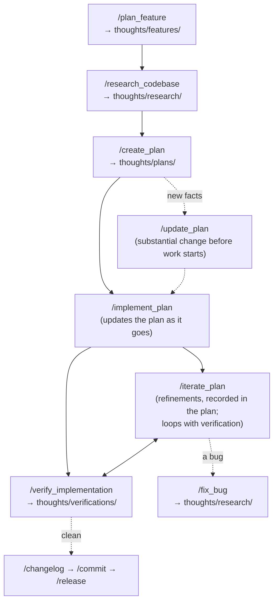

# Claude Configs

A workflow for building software with Claude Code, as a set of slash commands,
sub-agents, and conventions. The thinking behind each piece of work is written
down next to the code, step by step, so a reviewer reads the thought process
and not only the diff. It is simple by purpose: markdown files, no plugin, no
dependency on any skill suite.

By [Greger Teigre Wedel](https://stuff.greger.io) inspired by works from https://github.com/humanlayer/humanlayer.

## Install

Two steps: once per machine, once per project.

**1. Per machine**, put the files in `~/.claude`:

```bash
git clone https://github.com/gregertw/claude.git /tmp/claude-workflow
bash /tmp/claude-workflow/bin/install
```

This copies `commands/`, `agents/`, `tools/`, `templates/` and `bin/` into
`~/.claude`, plus this README as `~/.claude/WORKFLOW-README.md`, and touches
nothing else there. Re-run it to update. (If
`~/.claude` is empty you can clone straight into it instead; the repo's
`.gitignore` ignores everything except these directories.)

**2. Per project**, from the project root:

```bash
bash ~/.claude/bin/init-project
```

This creates `thoughts/` with its README, appends a `## Workflow` section to
`CLAUDE.md` from the template, creates `.claude/workflow/` for per-command
addenda, and prints which tools were detected. It never overwrites a file that
exists. Then fill in the placeholders in `CLAUDE.md`, starting with `### Checks`
(the commands to run) and `### App` (how to start it), and commit.

That is all. Type `/plan_feature` for a new feature, `/research_codebase` for
a question about the code, or `/fix_bug` for a bug.

### For an AI installing this workflow

If you are an AI assistant asked to install this workflow into a project:

1. Run the two commands above (the second one from the project root).
2. Open `CLAUDE.md`, find `## Workflow`, and fill in every placeholder in
   square brackets from what the project actually uses: read `package.json`,
   `pyproject.toml`, `Makefile`, CI workflows, and any existing `CLAUDE.md`
   text for the check commands, the dev server command and port, the changelog
   style, and the release steps. Delete subsections that do not apply. Do not
   guess a value you cannot find; leave the placeholder and say so.
3. If `CLAUDE.md` already described a development workflow, merge it into the
   new section rather than keeping two.
4. If `thoughts/README.md` already existed, compare its directory table with
   the default in `~/.claude/templates/thoughts-README.md` and ask before
   adding a row.
5. Run `bash ~/.claude/bin/detect-tools` and report which provider each
   capability will use; add `### Tools` pins only when the project needs a
   different one.
6. Report what you created, what you filled in, and what is still a
   placeholder.

## The work process

The idea is simple: the thinking behind a piece of work is worth as much as the
code, so it lives in the repository next to the code, as dated markdown files
under `thoughts/`, written by the commands as the work moves along. A reviewer
reads the thought process, not only the diff. A teammate picking the work up
in three months finds what was decided and why. Every command in this repo is
one step in that process, and every step leaves a document behind.

### The chain

A feature runs through five steps, each with its own command and its own
document. One slug, minted at the start, ties them together:



```
thoughts/features/2026-09-17-offline-sync.md      what we want, and how we will know
thoughts/research/2026-09-19-offline-sync.md      what the code and the world say about it
thoughts/plans/2026-09-20-offline-sync.md         what we will do, in phases
thoughts/verifications/2026-09-28-offline-sync.md what actually landed
```

1. **Feature definition: `/plan_feature`.** Happens before anyone looks at the
   code, on purpose. Starting in the codebase anchors the thinking on what
   exists; this step anchors it on the users. It is a conversation, one topic
   at a time: who has the problem and what it costs them, a premise check (is
   this the right problem, what if we do nothing), the outcome as an
   observable change in the user's world, the 10x version and the smallest
   version that still delivers, the user experience as a narrative, success
   measures with how each is observed, two or three hypotheses with one
   chosen, what is out of scope and why, and the open questions that research
   must answer. It mints the slug.
2. **Research: `/research_codebase`.** Takes the feature document, derives
   research questions from the hypothesis and open questions, and fans them
   out to sub-agents that read the code and the web. Given a plain question
   instead of a feature document, it investigates that. The output ends with
   the decisions that need a human before planning can start.
3. **Planning: `/create_plan`, then `/update_plan`.** Resolves the decisions
   with the user, agrees the phasing, writes a draft, and then evaluates the
   draft from six angles: architecture, security, scalability, usability,
   tests and code quality, and an outside voice that looks for what the other
   five missed. Every concern must quote the line that motivates it. The plan
   lists what already exists and is reused, one realistic production failure
   per new codepath, and the reason behind every item that is out of scope.
   `/update_plan` is for when new facts change a plan that has not started;
   it re-runs the same evaluation on the changed phases.
4. **Implementation: `/implement_plan`, then `/iterate_plan`.** Phase by
   phase, all checks green after each phase, the plan updated as it goes so it
   always reflects reality. Agents can take separate phases. `/iterate_plan`
   is for the refinements that follow your own look at the result, or a
   verification's findings: wording, flow, small missing pieces, bugs. Each
   batch is recorded in the plan's Iterations section, so the plan stays the
   single record of what was built.
5. **Verification: `/verify_implementation`.** Treat it the way you would
   review a junior's work: assume something was missed. It reads the actual
   code against the plan, runs every check itself, exercises any UI in a real
   browser, checks that every success measure from the feature document can
   actually be observed, hunts for defects with a named checklist and an
   adversarial second opinion, and writes a verification document. Iterate and
   verify form a loop: run it again after fixes, and each run is a new dated
   document that reports the fate of the previous run's findings. The latest
   clean verification closes the plan, linked from the plan's frontmatter.

Two side entries:

- **Bugs: `/fix_bug`.** Root cause before any change: reproduce, trace, bisect
  when it worked before, write a testable hypothesis, confirm it with
  instrumentation, then fix with the smallest diff and a regression test that
  fails before and passes after. The investigation is a dated record in
  `thoughts/research/`, and if the bug belongs to an implemented plan it is
  also logged there.
- **Shipping: `/changelog`, `/commit`, `/release`.** The changelog is
  written from the branch diff, the commit refuses to run until the changelog
  covers the changes, and the release command decides the version, bumps and
  promotes, lands it through a PR, tags, and runs any publish step the
  project's recipe names. It works for apps, libraries, packages, and repos
  with nothing versioned, where the PR is the release.

### Where documents live

Six directories under `thoughts/`. A directory is a *kind* of document, never
a *status*; nothing moves when it is finished.

| Directory | Holds | Dated? |
| --- | --- | --- |
| `features/` | What we want to achieve | yes |
| `research/` | What we found out, including bug investigations | yes |
| `plans/` | What we intend to do | yes |
| `verifications/` | Evidence a plan landed | yes |
| `reference/` | Durable knowledge: protocol flows, runbooks | no |
| `todo/` | Known work not yet scheduled | no |

Dated files are snapshots and are not edited afterwards. Undated files are
living and are edited in place, then deleted when they stop being true. Only
plans carry a `status:` in their frontmatter, from a closed vocabulary of
`proposed`, `active`, `done`, `superseded`, so that a grep for `active` always
answers "what is in flight" truthfully.

### Tools

The commands describe their own process and never depend on another skill
suite or plugin. Where an installed tool does a job better, a headless browser
for QA or a second model for review, a command names a *capability* and
`tools/<capability>.md` says which providers supply it, how to detect them,
and what to do when none is present. First available provider wins; a
project's `CLAUDE.md` can pin one under `### Tools` in its `## Workflow` section; absence is
always a documented degradation, never a silent skip. See `tools/README.md`.

## Customizing the workflow in a project

The commands are shared and live at user level, so a project cannot shadow one
by name (measured on Claude Code 2.1.274: the user-level command wins when both
exist; the docs say the same for skills, and command precedence is
undocumented). Every
customization is therefore something the commands **read from the project**:

- **The contract: `## Workflow` in `CLAUDE.md`.** Fixed subsections the
  commands read before their first step: `### Checks` (a fast tier after each
  phase and a full tier before commits, verification, and release, plus
  preconditions the commands obey), `### App` (start commands for checks and
  for browser QA, base URL, allowed hosts, seed), `### Test account`
  (throwaway credentials the browser agent may type, or `none`),
  `### Commits` (attribution lines kept or stripped), `### CI policy` (what
  triggers CI, who re-triggers, the local pre-PR gate), `### Tools` (pins),
  `### Changelog`, `### Release`, `### Dependencies`, `### Thoughts` (layout
  plus any rule for writing there). The template is
  `templates/CLAUDE-workflow.md`.
- **Tool pins** under `### Tools`: `use <provider>`, `run <project script>`,
  or `none`. The accepted strings are tabled in `tools/README.md`.
- **Per-command addenda** in `.claude/workflow/<command>.md`, read after the
  contract. For rules that belong to one command: "after a follow-up push,
  stop and hand the CI re-trigger to the user", "keep the what's-new file in
  sync with the changelog".
- **The layout of `thoughts/`** is whatever the project's `thoughts/README.md`
  says. A command that needs a directory the README does not list asks before
  creating it.
- **Autonomous runs.** When no user is available, the commands do not block:
  they derive what they can from documents, mark those decisions "deduced, not
  confirmed", and list them as undecided.

## Agents

Sub-agents keep long or noisy work out of the main context and give the
commands a single place to change when a tool changes. Two kinds live in
`agents/`: research agents that read, and adapter agents that wrap a
capability so that the fallback is the agent itself.

| Agent | Used by | What it does |
| --- | --- | --- |
| `codebase-analyzer` | plan_feature, research_codebase, verify_implementation | Explains how a specific component works today, with `file:line` references. Documents, never suggests. |
| `web-search-researcher` | research_codebase, fix_bug | Finds current information outside the codebase and returns sources with quotes and dates. The web-search capability. |
| `browser-qa` | verify_implementation, iterate_plan, fix_bug | Exercises a running app in a real browser: console after every interaction, forms three ways, states, mobile width, the feature's paths end to end. Picks the browser provider per `tools/browser.md`, reports which one it used, and returns findings with severity and evidence. Never types credentials, never fixes. |
| `outside-voice` | create_plan, update_plan, verify_implementation, fix_bug | The reviewer who was not in the room. Given a plan or a diff and the findings so far, it looks for what was missed. Runs a second model when one is installed, per `tools/second-opinion.md`, and is the fresh-context reviewer otherwise. Findings only, each with the line that motivates it. |

The built-in `Explore` agent is used alongside these for broad read-only
searches.

## bin

- **`bin/install`** copies this repo's directories into `~/.claude` (or
  `$CLAUDE_HOME`). Re-run to update. Touches nothing else.
- **`bin/init-project`** sets a project up: `thoughts/` and its README, the
  `## Workflow` contract appended to `CLAUDE.md`, `.claude/workflow/`, and a
  tool report. Idempotent; never overwrites.
- **`bin/detect-tools`** prints one line per capability with the provider that
  will be used: a `### Tools` pin from `CLAUDE.md` if present, otherwise the
  first available provider, for example `BROWSER=pinned:use gstack browse` or
  `SCOPE_LOCK=self-check`. It checks paths and executables only, starts
  nothing, and never fails. Adding a provider is one case here plus one entry
  in the capability file.

## Contents

- **commands/** - The slash commands, one per step of the process
- **agents/** - Sub-agent definitions: two research agents, two adapter agents
- **tools/** - Capability contracts: which installed tools a command may use, how to detect them, and the fallback
- **templates/** - The `## Workflow` contract for `CLAUDE.md`, the `thoughts/README.md`, and the addenda README that `init-project` installs
- **bin/** - `install`, `init-project`, `detect-tools`

## License

This work is licensed under [Creative Commons Attribution 4.0 International (CC BY 4.0)](https://creativecommons.org/licenses/by/4.0/).

You are free to use, share, and adapt these configurations for any purpose.
